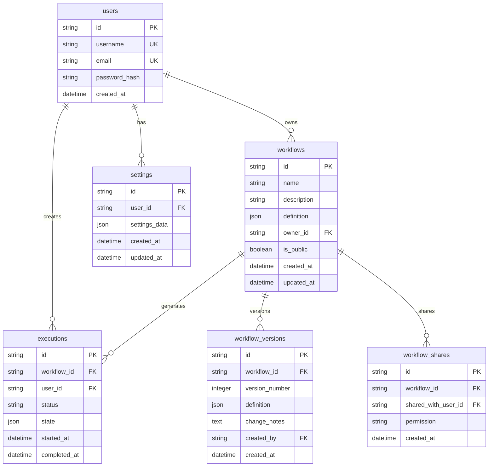

# Storage Integration Guide

**Version:** 1.0.0  
**Last Updated:** 2024-01-01

## Overview

This guide explains how to configure and integrate different storage backends for the workflow engine. The **Java** service supports **SQLite** by default and **PostgreSQL** in production via Spring datasource configuration (see `backend-java/src/main/resources/application*.properties`).

## Database Schema Diagram


```mermaid
erDiagram
    users ||--o{ workflows : owns
    users ||--o{ executions : creates
    users ||--o{ settings : has
    workflows ||--o{ executions : generates
    workflows ||--o{ workflow_versions : versions
    workflows ||--o{ workflow_shares : shares
    
    users {
        string id PK
        string username UK
        string email UK
        string password_hash
        datetime created_at
    }
    
    workflows {
        string id PK
        string name
        string description
        json definition
        string owner_id FK
        boolean is_public
        datetime created_at
        datetime updated_at
    }
    
    executions {
        string id PK
        string workflow_id FK
        string user_id FK
        string status
        json state
        datetime started_at
        datetime completed_at
    }
    
    settings {
        string id PK
        string user_id FK
        json settings_data
        datetime created_at
        datetime updated_at
    }
    
    workflow_versions {
        string id PK
        string workflow_id FK
        integer version_number
        json definition
        text change_notes
        string created_by FK
        datetime created_at
    }
    
    workflow_shares {
        string id PK
        string workflow_id FK
        string shared_with_user_id FK
        string permission
        datetime created_at
    }
```

**Quick start**
1. Choose SQLite for local development or PostgreSQL for production.
2. Set **`spring.datasource.*`** (or activate the `postgresql` Spring profile) in `backend-java/src/main/resources/application*.properties`.
3. Run the API from `backend-java/` (for example `./gradlew bootRun`). Schema updates follow **`spring.jpa.hibernate.ddl-auto`**.
4. For production, tune **HikariCP**, enable TLS to the database, and configure backups.

**See Also:**
- [Migration Guide](./MIGRATION_GUIDE.md) - Moving between databases
- [Performance Tuning Guide](./PERFORMANCE_TUNING_GUIDE.md) - Database optimization

## Supported Storage Backends

### SQLite (Default)
- **Use Case**: Development, testing, small deployments
- **Pros**: No setup required, file-based, portable
- **Cons**: Limited concurrency, not suitable for production scale

### PostgreSQL (Recommended for Production)
- **Use Case**: Production deployments, high concurrency
- **Pros**: Excellent performance, ACID compliance, advanced features
- **Cons**: Requires separate database server

### MySQL/MariaDB
- **Use Case**: Production deployments, existing MySQL infrastructure
- **Pros**: Widely supported, good performance
- **Cons**: Requires separate database server

## Configuration (Spring Boot)

Configure the database with **JDBC** via **`spring.datasource.*`** (and optional profile files such as `application-postgresql.properties`). Do not use generic `DATABASE_URL` strings unless your deployment explicitly maps them into Spring properties.

**SQLite (typical local dev):**
```properties
spring.datasource.url=jdbc:sqlite:./workflows.db
spring.datasource.driver-class-name=org.sqlite.JDBC
```

**PostgreSQL (typical production):**
```properties
spring.datasource.url=jdbc:postgresql://localhost:5432/workflows
spring.datasource.username=workflow_user
spring.datasource.password=your_password
spring.datasource.driver-class-name=org.postgresql.Driver
```

Tune **`spring.datasource.hikari.*`** for pool size, timeouts, and leak detection. See Spring Boot datasource documentation for the full property set.

## Setup Instructions

### SQLite Setup

No separate database server is required. With the properties above, **`workflows.db`** is created beside the process working directory when the app starts.

### PostgreSQL Setup

#### 1. Install PostgreSQL

**macOS:**
```bash
brew install postgresql@15
brew services start postgresql@15
```

**Ubuntu/Debian:**
```bash
sudo apt-get update
sudo apt-get install postgresql postgresql-contrib
sudo systemctl start postgresql
```

**Docker:**
```bash
docker run --name postgres \
  -e POSTGRES_PASSWORD=yourpassword \
  -e POSTGRES_DB=workflows \
  -p 5432:5432 \
  -d postgres:15
```

#### 2. Create Database

```bash
# Connect to PostgreSQL
psql -U postgres

# Create database and user
CREATE DATABASE workflows;
CREATE USER workflow_user WITH PASSWORD 'your_password';
GRANT ALL PRIVILEGES ON DATABASE workflows TO workflow_user;
\q
```

#### 3. Point Spring at PostgreSQL

Set `spring.datasource.url` to a **`jdbc:postgresql://...`** URL and matching username/password (see `application-postgresql.properties` in `backend-java/` for the pattern your deployment uses).

#### 4. Start the API and verify schema

```bash
cd backend-java && ./gradlew bootRun
```

```bash
psql -U app_user -d workflows_prod -c "\dt"
```

You should see tables such as `users`, `workflows`, `executions`, `settings`, and related workflow tables.

### MySQL Setup

#### 1. Install MySQL

**macOS:**
```bash
brew install mysql
brew services start mysql
```

**Ubuntu/Debian:**
```bash
sudo apt-get update
sudo apt-get install mysql-server
sudo systemctl start mysql
```

**Docker:**
```bash
docker run --name mysql \
  -e MYSQL_ROOT_PASSWORD=rootpassword \
  -e MYSQL_DATABASE=workflows \
  -e MYSQL_USER=workflow_user \
  -e MYSQL_PASSWORD=your_password \
  -p 3306:3306 \
  -d mysql:8.0
```

#### 2. Create Database

```bash
# Connect to MySQL
mysql -u root -p

# Create database and user
CREATE DATABASE workflows CHARACTER SET utf8mb4 COLLATE utf8mb4_unicode_ci;
CREATE USER 'workflow_user'@'localhost' IDENTIFIED BY 'your_password';
GRANT ALL PRIVILEGES ON workflows.* TO 'workflow_user'@'localhost';
FLUSH PRIVILEGES;
EXIT;
```

#### 3. JDBC driver for MySQL

Add the MySQL JDBC driver to the Gradle dependencies if you choose MySQL, then set `spring.datasource.url=jdbc:mysql://...` and the matching username, password, and driver class.

## Database Schema

The application persists workflows and executions through **JPA entities** in `backend-java/` (see entity classes under `com.workflow.entity`). See the [Database Schema Diagram](#database-schema-diagram) above for a visual representation.

### Core Tables

**users**
- `id`: Primary key (UUID or integer)
- `username`: Unique username
- `email`: Unique email address
- `password_hash`: Bcrypt-hashed password
- `created_at`: Timestamp

**workflows**
- `id`: Primary key
- `name`: Workflow name
- `description`: Workflow description
- `definition`: JSON workflow definition
- `owner_id`: Foreign key to users
- `is_public`: Boolean visibility flag
- `created_at`, `updated_at`: Timestamps

**executions**
- `id`: Primary key
- `workflow_id`: Foreign key to workflows
- `user_id`: Foreign key to users
- `status`: Execution status (pending, running, completed, failed)
- `state`: JSON execution state
- `started_at`, `completed_at`: Timestamps

**settings**
- `id`: Primary key
- `user_id`: Foreign key to users
- `settings_data`: JSON settings (LLM providers, etc.)
- `created_at`, `updated_at`: Timestamps

## Migration and Schema Updates

### Automatic schema updates

Hibernate **`spring.jpa.hibernate.ddl-auto`** controls whether tables are created or updated at startup. Use a conservative value in production (often `validate` plus explicit migrations).

### Manual migrations

For production schema evolution, prefer **Flyway** or **Liquibase** migrations checked into `backend-java/` rather than ad-hoc DDL. Align migration scripts with the JPA entities under `com.workflow.entity`.

## Connection pooling (Java)

**HikariCP** (Spring Boot default) settings such as `spring.datasource.hikari.maximum-pool-size` apply. Tune them in `application-production.properties` or environment-specific config for your JDBC URL—see Spring Boot datasource documentation.
- Adjust based on concurrent request load

### Monitoring pool usage

Expose **Spring Boot Actuator** (if enabled in your build) and inspect Hikari metrics, or watch JDBC wait times and thread stalls in your APM. At minimum, log slow queries and pool exhaustion warnings from the datasource.

## Backup and Recovery

### SQLite Backup

```bash
# Simple file copy
cp workflows.db workflows.db.backup

# Using SQLite backup command
sqlite3 workflows.db ".backup workflows.db.backup"
```

### PostgreSQL Backup

```bash
# Full database backup
pg_dump -U workflow_user workflows > backup.sql

# Restore
psql -U workflow_user workflows < backup.sql

# Automated backup script
#!/bin/bash
DATE=$(date +%Y%m%d_%H%M%S)
pg_dump -U workflow_user workflows > "backup_${DATE}.sql"
```

### MySQL Backup

```bash
# Full database backup
mysqldump -u workflow_user -p workflows > backup.sql

# Restore
mysql -u workflow_user -p workflows < backup.sql
```

## Performance Optimization

### Indexes

The application creates indexes on frequently queried fields:

- `users.username` (unique)
- `users.email` (unique)
- `workflows.owner_id`
- `executions.workflow_id`
- `executions.user_id`
- `executions.status`

### Query optimization

- Prefer **parameterized** repository methods and bounded **`Pageable`** reads for lists.
- Use **`JOIN FETCH`** or **`@EntityGraph`** when you must hydrate associations without N+1 selects.
- Batch writes with **`saveAll`** / bulk operations where appropriate.

### Monitoring

Enable SQL diagnostics only when needed, for example:

```properties
# backend-java/src/main/resources/application.properties (dev only)
logging.level.org.hibernate.SQL=DEBUG
logging.level.org.hibernate.orm.jdbc.bind=TRACE
```

**Database metrics:**
- Connection pool usage
- Query execution time
- Slow query logging (PostgreSQL/MySQL)

## Troubleshooting

### Connection Issues

**Error: "Connection refused"**
- Verify database server is running
- Check host and port configuration
- Verify firewall rules

**Error: "Authentication failed"**
- Verify username and password
- Check user permissions
- Verify database exists

**Error: "Database does not exist"**
- Create database manually
- Verify database name in connection string

### Performance Issues

**Slow queries:**
- Check indexes are created
- Analyze query plans
- Consider connection pool size
- Monitor database load

**Connection pool exhaustion:**
- Increase `pool_size`
- Increase `max_overflow`
- Check for connection leaks
- Monitor connection usage

### Migration Issues

**Schema mismatch:**
- Verify JPA entities match the live schema
- Align `spring.jpa.hibernate.ddl-auto` with your migration strategy
- Check for manual schema changes outside Flyway/Liquibase

**Data type issues:**
- Verify JSON columns support JSON type (PostgreSQL 9.4+, MySQL 5.7+)
- Use `TEXT` type for JSON in older databases

## Security Considerations

### Connection Security

**Use SSL/TLS in production**

Append the appropriate SSL parameters to the JDBC URL for your vendor (for example PostgreSQL `sslmode=require` on the JDBC URL, or MySQL TLS parameters per the connector docs).

### Credential management

- Store usernames and passwords in environment variables, Kubernetes Secrets, or a secrets manager—not in Git.
- Map secrets into **`spring.datasource.username`** / **`spring.datasource.password`** (or Spring Cloud Config) at runtime.

## Production Checklist

- [ ] Use PostgreSQL or MySQL (not SQLite)
- [ ] Configure connection pooling appropriately
- [ ] Enable SSL/TLS connections
- [ ] Set up automated backups
- [ ] Monitor connection pool usage
- [ ] Configure database indexes
- [ ] Set up database replication (if needed)
- [ ] Use read replicas for read-heavy workloads
- [ ] Implement connection retry logic
- [ ] Set up database monitoring and alerts

## Related Documentation

- [Java backend README](../backend-java/README.md) - Database models and patterns
- [Technical Design](./TECHNICAL_DESIGN.md) - Database schema details
- [Kubernetes Deployment](./KUBERNETES_DEPLOYMENT.md) - Production deployment with databases
