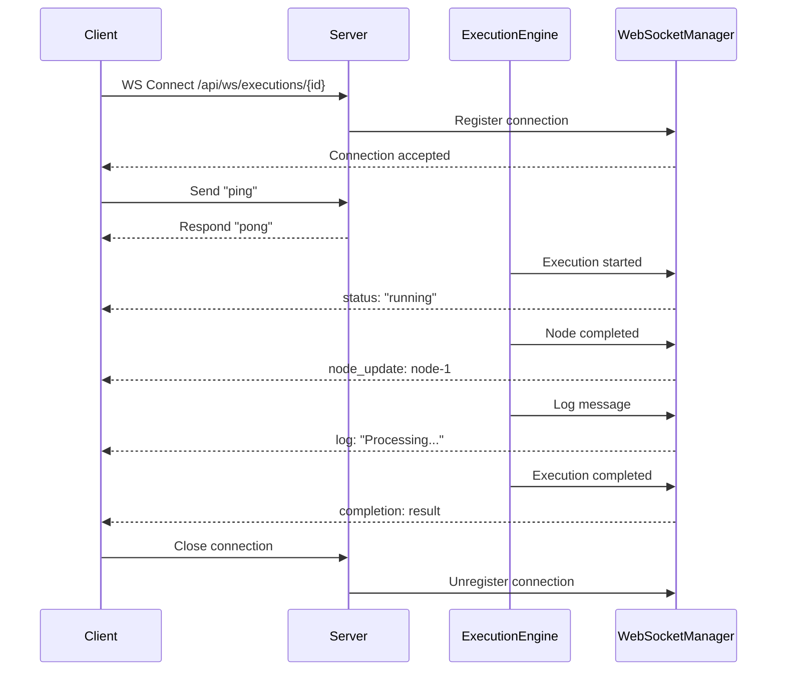

# WebSocket API Guide

**Version:** 1.0.0  
**Last Updated:** 2024-01-01

## Overview

The WebSocket API provides real-time updates for workflow executions. Clients can connect to receive live status updates, node execution progress, logs, and completion notifications.

## WebSocket Connection Flow



**When to Use WebSockets:**
- Real-time execution monitoring
- Live progress updates
- Streaming log messages
- Immediate completion notifications

**When to Use REST API:**
- One-time data fetching
- Creating/updating resources
- Historical data queries
- Operations that don't need real-time updates

## Connection

### Endpoint

```
WS /api/ws/executions/{execution_id}
```

**Parameters:**
- `execution_id`: The execution ID to monitor

### Connection Example

**JavaScript:**
```javascript
const executionId = "exec-123";
const ws = new WebSocket(`ws://localhost:8000/api/ws/executions/${executionId}`);

ws.onopen = () => {
  console.log("WebSocket connected");
};

ws.onmessage = (event) => {
  const message = JSON.parse(event.data);
  console.log("Received:", message);
};

ws.onerror = (error) => {
  console.error("WebSocket error:", error);
};

ws.onclose = () => {
  console.log("WebSocket closed");
};
```

**Python:**
```python
import asyncio
import websockets
import json

async def connect_execution_stream(execution_id: str):
    uri = f"ws://localhost:8000/api/ws/executions/{execution_id}"
    async with websockets.connect(uri) as websocket:
        while True:
            message = await websocket.recv()
            data = json.loads(message)
            print(f"Received: {data}")

asyncio.run(connect_execution_stream("exec-123"))
```

## Message Types

### Status Update

Sent when execution status changes (pending → running → completed/failed).

```json
{
  "type": "status",
  "execution_id": "exec-123",
  "status": "running",
  "data": {
    "progress": 0.5,
    "current_node": "node-2"
  },
  "timestamp": "1704067200.123"
}
```

**Status Values:**
- `pending`: Execution queued, not started
- `running`: Execution in progress
- `completed`: Execution finished successfully
- `failed`: Execution failed with error

### Node Update

Sent when a node execution state changes.

```json
{
  "type": "node_update",
  "execution_id": "exec-123",
  "node_id": "node-1",
  "node_state": {
    "status": "completed",
    "output": {
      "result": "Hello, World!"
    },
    "error": null,
    "started_at": "1704067200.0",
    "completed_at": "1704067201.5"
  },
  "timestamp": "1704067201.5"
}
```

**Node Status Values:**
- `pending`: Node not yet executed
- `running`: Node currently executing
- `completed`: Node finished successfully
- `failed`: Node execution failed

### Log Entry

Sent for log messages during execution.

```json
{
  "type": "log",
  "execution_id": "exec-123",
  "log": {
    "level": "info",
    "message": "Starting node execution",
    "node_id": "node-1",
    "timestamp": "1704067200.0"
  },
  "timestamp": "1704067200.123"
}
```

**Log Levels:**
- `debug`: Debug information
- `info`: Informational messages
- `warning`: Warning messages
- `error`: Error messages

### Completion

Sent when execution completes successfully.

```json
{
  "type": "completion",
  "execution_id": "exec-123",
  "result": {
    "status": "completed",
    "output": {
      "final_result": "Workflow completed successfully"
    },
    "nodes_completed": 3,
    "nodes_failed": 0,
    "duration": 45.2
  },
  "timestamp": "1704067245.2"
}
```

### Error

Sent when execution fails.

```json
{
  "type": "error",
  "execution_id": "exec-123",
  "error": "Node 'node-2' failed: API key invalid",
  "timestamp": "1704067205.0"
}
```

### Pong (Response to Ping)

Response to client ping message.

```json
{
  "type": "pong"
}
```

## Client Messages

### Ping

Send `ping` to keep connection alive and verify connectivity.

```javascript
ws.send("ping");
```

**Response:**
```json
{
  "type": "pong"
}
```

## Connection Lifecycle

### 1. Connect

```javascript
const ws = new WebSocket(`ws://localhost:8000/api/ws/executions/${executionId}`);
```

**When to Connect:**
- Immediately after starting execution
- When viewing execution details page
- When resuming monitoring a running execution

### 2. Receive Updates

```javascript
ws.onmessage = (event) => {
  const message = JSON.parse(event.data);
  
  switch (message.type) {
    case "status":
      handleStatusUpdate(message);
      break;
    case "node_update":
      handleNodeUpdate(message);
      break;
    case "log":
      handleLog(message);
      break;
    case "completion":
      handleCompletion(message);
      break;
    case "error":
      handleError(message);
      break;
  }
};
```

### 3. Handle Disconnection

```javascript
ws.onclose = (event) => {
  if (event.wasClean) {
    console.log("Connection closed cleanly");
  } else {
    console.log("Connection lost, reconnecting...");
    // Implement reconnection logic
    reconnect();
  }
};
```

### 4. Reconnection

```javascript
function reconnect() {
  setTimeout(() => {
    const ws = new WebSocket(`ws://localhost:8000/api/ws/executions/${executionId}`);
    // Set up event handlers again
    setupWebSocketHandlers(ws);
  }, 1000);
}
```

## Implementation Examples

### React Hook

```typescript
import { useEffect, useRef, useState } from 'react';

interface WebSocketMessage {
  type: string;
  execution_id: string;
  [key: string]: any;
}

export function useExecutionStream(executionId: string | null) {
  const [status, setStatus] = useState<string>('pending');
  const [nodeStates, setNodeStates] = useState<Record<string, any>>({});
  const [logs, setLogs] = useState<any[]>([]);
  const [error, setError] = useState<string | null>(null);
  const wsRef = useRef<WebSocket | null>(null);

  useEffect(() => {
    if (!executionId) return;

    const ws = new WebSocket(
      `ws://localhost:8000/api/ws/executions/${executionId}`
    );

    ws.onopen = () => {
      console.log('WebSocket connected');
    };

    ws.onmessage = (event) => {
      const message: WebSocketMessage = JSON.parse(event.data);

      switch (message.type) {
        case 'status':
          setStatus(message.status);
          break;
        case 'node_update':
          setNodeStates(prev => ({
            ...prev,
            [message.node_id]: message.node_state
          }));
          break;
        case 'log':
          setLogs(prev => [...prev, message.log]);
          break;
        case 'completion':
          setStatus('completed');
          break;
        case 'error':
          setError(message.error);
          setStatus('failed');
          break;
      }
    };

    ws.onerror = (error) => {
      console.error('WebSocket error:', error);
      setError('WebSocket connection error');
    };

    ws.onclose = () => {
      console.log('WebSocket closed');
    };

    wsRef.current = ws;

    return () => {
      ws.close();
    };
  }, [executionId]);

  return { status, nodeStates, logs, error };
}
```

### Vue.js Composable

```typescript
import { ref, onMounted, onUnmounted } from 'vue';

export function useExecutionStream(executionId: string) {
  const status = ref('pending');
  const nodeStates = ref<Record<string, any>>({});
  const logs = ref<any[]>([]);
  const error = ref<string | null>(null);
  let ws: WebSocket | null = null;

  onMounted(() => {
    ws = new WebSocket(
      `ws://localhost:8000/api/ws/executions/${executionId}`
    );

    ws.onmessage = (event) => {
      const message = JSON.parse(event.data);

      switch (message.type) {
        case 'status':
          status.value = message.status;
          break;
        case 'node_update':
          nodeStates.value[message.node_id] = message.node_state;
          break;
        case 'log':
          logs.value.push(message.log);
          break;
        case 'error':
          error.value = message.error;
          status.value = 'failed';
          break;
      }
    };
  });

  onUnmounted(() => {
    ws?.close();
  });

  return { status, nodeStates, logs, error };
}
```

## Error Handling

### Connection Errors

```javascript
ws.onerror = (error) => {
  console.error("WebSocket error:", error);
  // Handle error (show notification, retry, etc.)
};

ws.onclose = (event) => {
  if (!event.wasClean) {
    // Unexpected disconnect, attempt reconnection
    reconnect();
  }
};
```

### Message Parsing Errors

```javascript
ws.onmessage = (event) => {
  try {
    const message = JSON.parse(event.data);
    // Process message
  } catch (error) {
    console.error("Failed to parse message:", error);
    // Handle invalid message
  }
};
```

## Performance Considerations

### Connection Limits

- Each execution can have multiple WebSocket connections
- Connections are automatically cleaned up on disconnect
- Consider connection pooling for multiple executions

### Message Frequency

- Status updates: On status changes
- Node updates: On node state changes
- Log entries: As logs are generated
- High-frequency updates may impact performance

### Optimization Tips

**Throttle Updates:**
```javascript
let lastUpdate = 0;
const throttleMs = 100;

ws.onmessage = (event) => {
  const now = Date.now();
  if (now - lastUpdate < throttleMs) {
    return; // Skip this update
  }
  lastUpdate = now;
  // Process message
};
```

**Batch Updates:**
```javascript
const updateQueue: any[] = [];
let updateTimer: NodeJS.Timeout | null = null;

ws.onmessage = (event) => {
  const message = JSON.parse(event.data);
  updateQueue.push(message);

  if (!updateTimer) {
    updateTimer = setTimeout(() => {
      processBatch(updateQueue);
      updateQueue.length = 0;
      updateTimer = null;
    }, 100);
  }
};
```

## Security

### Authentication

WebSocket connections currently don't require authentication. For production:

1. **Token-Based Auth:**
```javascript
const token = localStorage.getItem('auth_token');
const ws = new WebSocket(
  `ws://localhost:8000/api/ws/executions/${executionId}?token=${token}`
);
```

2. **Cookie-Based Auth:**
```javascript
// Cookies are automatically sent with WebSocket connections
const ws = new WebSocket(
  `ws://localhost:8000/api/ws/executions/${executionId}`
);
```

### Authorization

Verify execution access:
- Check user has permission to view execution
- Validate execution_id exists
- Ensure user owns execution or has access

## Troubleshooting

### Connection Fails

**Check:**
- WebSocket URL is correct
- Server is running
- Firewall allows WebSocket connections
- CORS configuration (if browser)

**Debug:**
```javascript
ws.onerror = (error) => {
  console.error("WebSocket error details:", error);
};

ws.onclose = (event) => {
  console.log("Close code:", event.code);
  console.log("Close reason:", event.reason);
};
```

### No Messages Received

**Check:**
- Execution is running
- Execution ID is correct
- Connection is open
- Server is broadcasting messages

**Debug:**
```javascript
ws.onopen = () => {
  console.log("Connected, sending ping...");
  ws.send("ping");
};
```

### Messages Out of Order

**Solution:**
- Include timestamps in messages
- Sort by timestamp on client
- Use sequence numbers (if added)

## Configuration

### Server Configuration

```python
# backend/config.py
websocket_ping_interval: int = 20  # seconds
websocket_timeout: int = 60  # seconds
```

### Client Configuration

```javascript
// Set WebSocket timeout
const ws = new WebSocket(url);
ws.onopen = () => {
  // Set ping interval
  setInterval(() => {
    if (ws.readyState === WebSocket.OPEN) {
      ws.send("ping");
    }
  }, 20000); // 20 seconds
};
```

## Related Documentation

- [Execution API Reference](./API_REFERENCE.md) - REST API for executions
- [Backend Developer Guide](./BACKEND_DEVELOPER_GUIDE.md) - WebSocket implementation
- [Technical Design](./TECHNICAL_DESIGN.md) - Real-time architecture
